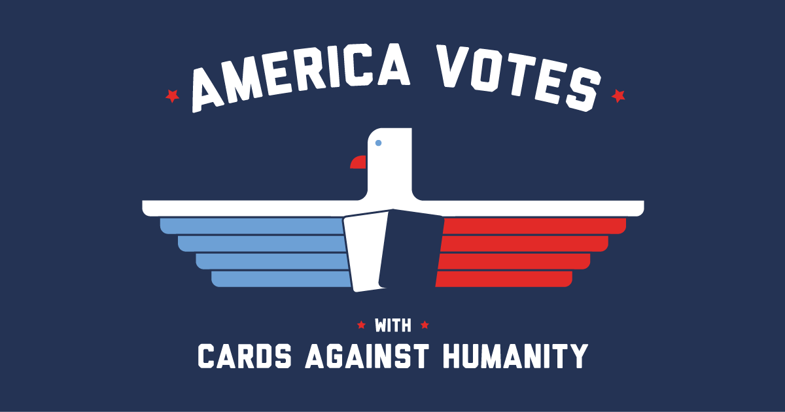

# MDS Saves America
### Cards Against Humanity: Future of Democracy and American Elections
---

## Project Summary:
The Future of Democracy and American Elections Dashboard project aims to provide a comprehensive analysis of public sentiment and perceptions surrounding American politics, during August 2018. Through intuitive visualizations and filtering options, users can explore general correlations across demographics and delve into specific insights related to Donald Trump's presidency and the opinion of the American public on the future of America. The dashboard offers a user-friendly interface for uncovering valuable insights from survey data collected by the cards against humanity [website](https://thepulseofthenation.com/#future).

## Dashboard Design (Draft):

## Contributors
Sampson Yu, 
Sophia Zhao 
Salva Umar, 
Arturo Rey

## ©️ License
The app code contained within this repository is licensed under the MIT license. See [the license file](LICENSE.md) for more information.

All reports contained here are licensed under the [Attribution-ShareAlike 4.0 International (CC BY-SA 4.0) License](https://creativecommons.org/licenses/by-sa/4.0/). See [the license file](LICENSE.md) for more information.

The dataset employed in this analysis is distributed under an open-source license.
