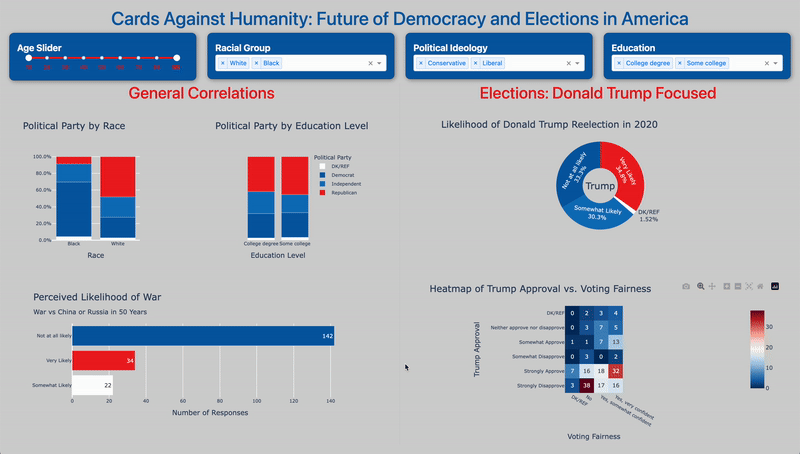

# MDS Saves America 
### Cards Against Humanity: Future of Democracy and American Elections

## Project Summary:
The Future of Democracy and American Elections Dashboard project aims to provide a comprehensive analysis of public sentiment and perceptions surrounding American politics, during August 2018. Through intuitive visualizations and filtering options, users can explore general correlations across demographics and delve into specific insights related to Donald Trump's presidency and the opinion of the American public on the future of America. The dashboard offers a user-friendly interface for uncovering valuable insights from survey data collected by the cards against humanity [website](https://thepulseofthenation.com/#future).

## Motivation Behind Our Project
### The Challenge
As the 2024 USA elections approach, American voters are faced with a pivotal decision: choosing their next President. This election is particularly challenging due to the unique backgrounds and histories of the candidates - Joseph Robinette Biden from the Democratic Party, and Donald John Trump from the Republican Party. Both candidates, having previously held the office, bring with them a mix of accomplishments and controversies. This complex backdrop makes it increasingly difficult for voters to align their choices with their personal ideologies and beliefs.

### Why It's Important
In a landscape brimming with information and varying opinions, it’s essential for voters to have a clear and unbiased perspective on what each candidate stands for. Understanding the pulse of the nation, especially reflecting back on opinions from a crucial period like August 2018, is key to making an informed decision. Our dashboard emerges as a crucial tool in this decision-making process.

### Our Solution
We have developed a dashboard that acts as a comprehensive guide for these elections. Utilizing the rich dataset from 'The Pulse of the Nation' survey conducted in August 2018, our dashboard offers an intuitive and interactive way for voters to explore crucial facets of the election:

- Candidate Ideologies: Delve into the core beliefs and stances of each candidate, providing clarity on what they represent.

- Ethnical Demographics and Public Opinion: Examine how different demographics view each candidate and understand the general sentiment of the public.

- User-Friendly Exploration: Through interactive visualizations and filters, users can seamlessly navigate through complex data, uncovering insights that resonate with their personal values.

By equipping voters with this tool, we aim to bridge the gap between information and understanding, empowering each American citizen to make a choice that truly reflects their hopes and ideals for the nation's future.

## Interactive Features of Our Dashboard
Our dashboard has been meticulously crafted to provide an engaging experience with several interactive elements that allow for personalized exploration. Here's what you can expect:

### Demographic Filters
Tailor your view by adjusting the demographic filters. You have control over:

- **Age Range:** A flexible slider to narrow down the data by specific age groups.
- **Racial Group:** A dropdown menu to select and view data for particular racial demographics.
- **Education Level:** Choose from various educational backgrounds to see how education influences political opinions.
- **Political Ideology:** A dropdown that sorts data by political leanings, from conservative to liberal and everything in between.

### Data Visualizations

- **Bar Charts:** Get a granular look at political affiliations across different demographics with our stacked bar charts. These visualizations dynamically adjust to your filter settings, giving you a detailed breakdown of the political landscape.
- **Donut Chart:** Discover the likelihood of Donald Trump's re-election at a glance. 
- **Tabulated Data:** View a comparative table that correlates Americans' approval of Donald Trump with their opinions on election fairness. This section provides a straightforward, numerical approach to understanding public perception.

### Explore Our Dashboard in Action
Get a glimpse of the dashboard's capabilities and user experience with our demo GIF. See firsthand how you can interact with the various elements and filters to obtain the insights you need.

For a full exploration and to discover all the features our dashboard has to offer, visit our deployed dashboard through the link provided [here](https://dsci-532-2024-14-mds-saves-america-10.onrender.com ). Dive into the data, play with the filters, and see the visualizations respond in real-time.

## Support
If you encounter any issues or have any questions about using our dashboard, please open an issue on GitHub.

## Running the App Locally
To run the app locally and potentially contribute to its development, follow these steps:

1. Clone this repository to your local machine.
2. Navigate to the project directory.
3. Install the environment using `conda env create -f environment.yml` and then activate it using the command `conda activate saves_america`
4. Run the app with `python src/app.py`.
5. Visit http://localhost:8050/ in your web browser to view the app.

For more information on contributing to the project, please refer to the [contributing guidelines](CONTRIBUTING.md).

## Contributors
Sampson Yu, 
Sophia Zhao, 
Salva Umar, 
Arturo Rey

## License
The app code contained within this repository is licensed under the MIT license. See [the license file](LICENSE.md) for more information.

All reports contained here are licensed under the [Attribution-ShareAlike 4.0 International (CC BY-SA 4.0) License](https://creativecommons.org/licenses/by-sa/4.0/). See [the license file](LICENSE.md) for more information.

The dataset employed in this analysis is distributed under an open-source license.
